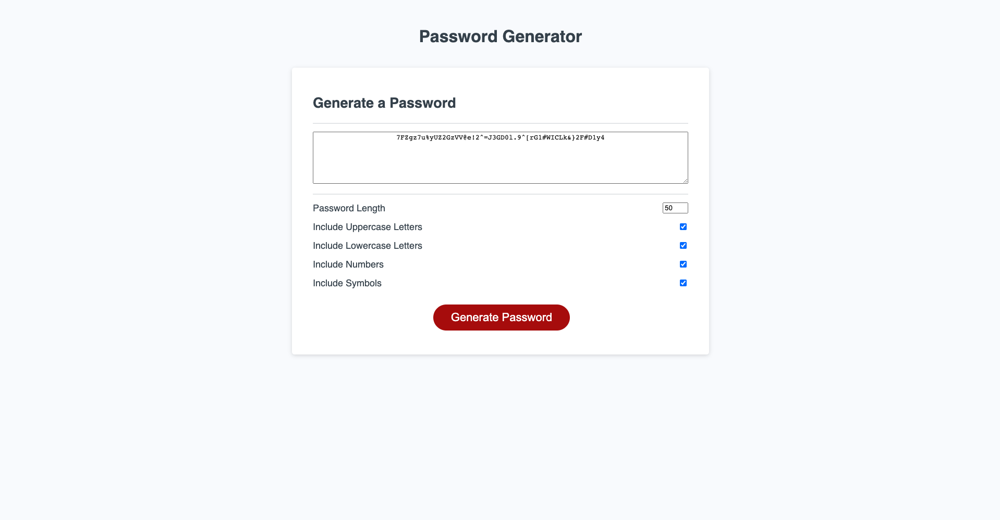

# Password Generator

## Project Background
An application that enables employees with access to sensitive data to generate random passwords based on criteria that they’ve selected.

## Course of Action
- Input desired password length between 8-128 characters.
- Check boxes to include lowercase letters, uppercase letters, numbers and symbols.
- Generate random password based on their selection.
- Display password in text area.

## Git Hub Repository
The link takes you to the repository where the portfolio is hosted.
https://github.com/tahlialg/password-generator

## Deployed Application
The link showcases the deployed professional portfolio.
https://tahlialg.github.io/password-generator/

